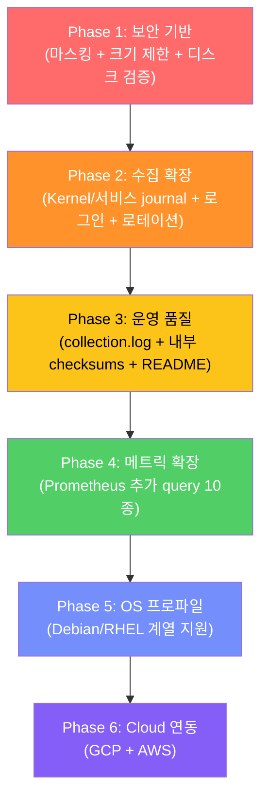

# Incident Collector 프로젝트 개선 방안 분석

## 현재 구현 상태 요약

현재 프로젝트는 **MVP 수준**으로, AGENTS.md에 정의된 전체 스펙 대비 핵심 골격만 구현되어 있습니다.

### ✅ 구현 완료

| 영역 | 모듈 | 상태 |
|------|------|------|
| CLI 진입점 | [cli.py](file:///c:/Users/user/Desktop/github/extract_system_log/src/incident_collector/cli.py) | `collect`, `validate-config` 서브커맨드 |
| YAML 설정 로드 | [config.py](file:///c:/Users/user/Desktop/github/extract_system_log/src/incident_collector/config.py) | 기본 설정 구조, 시간 범위 검증 |
| OS 감지 | [os_detection.py](file:///c:/Users/user/Desktop/github/extract_system_log/src/incident_collector/os_detection.py) | Ubuntu 24.04 전용 |
| 경로 안전성 | [safety.py](file:///c:/Users/user/Desktop/github/extract_system_log/src/incident_collector/safety.py) | symlink 거부, path traversal 차단 |
| 시스템 스냅샷 | [system.py](file:///c:/Users/user/Desktop/github/extract_system_log/src/incident_collector/collectors/system.py) | OS/CPU/메모리/디스크/프로세스 top 15 |
| Journal 수집 | [journal.py](file:///c:/Users/user/Desktop/github/extract_system_log/src/incident_collector/collectors/journal.py) | `journalctl --since/--until` 기본 수집 |
| 파일 수집 | [files.py](file:///c:/Users/user/Desktop/github/extract_system_log/src/incident_collector/collectors/files.py) | 지정 경로 스트리밍 복사 |
| Prometheus 메트릭 | [prometheus.py](file:///c:/Users/user/Desktop/github/extract_system_log/src/incident_collector/collectors/prometheus.py) | CPU/메모리/Load Avg 3개 query_range |
| 결과 패키징 | [output.py](file:///c:/Users/user/Desktop/github/extract_system_log/src/incident_collector/output.py) | manifest.json, tar.gz, SHA256 |
| 분석 프롬프트 | [ANALYSIS_PROMPT.md](file:///c:/Users/user/Desktop/github/extract_system_log/ANALYSIS_PROMPT.md) | AI Agent용 분석 템플릿 |
| 테스트 | [tests/](file:///c:/Users/user/Desktop/github/extract_system_log/tests) | 8개 테스트 모듈 (mock 기반) |

### ❌ 미구현 (AGENTS.md 스펙 대비)

| 영역 | AGENTS.md 섹션 | 현재 상태 |
|------|----------------|-----------|
| **민감정보 마스킹** | §11 | 완전 미구현 |
| **Kernel journal 수집** | §7.1 | 미구현 (`-k` 옵션) |
| **서비스별 journal 수집** | §7.1 | 미구현 (`--unit` 옵션) |
| **로그인/사용자 활동 수집** | §8 | 미구현 (`last`, `lastlog`, `who`, SSH journal) |
| **Command history 수집** | §8 | 미구현 (`/var/log/prompt.log`) |
| **로테이션/gzip 로그 처리** | §7.2 | 미구현 (`syslog.1`, `*.gz`) |
| **시간 범위 필터링** | §5 | 파일 수집 시 시간 기반 필터 없음 |
| **추가 Prometheus 메트릭** | §9 | Filesystem, Disk I/O, Network, OOM 미구현 |
| **GCP 연동** | §10.1 | 완전 미구현 |
| **AWS 연동** | §10.2 | 완전 미구현 |
| **다중 OS 지원** | §3 | Ubuntu 24.04 전용, 프로파일 분리 없음 |
| **크기 제한** | §6 | `max_file_size_mb`, `max_total_size_mb` 미적용 |
| **디스크 여유 공간 사전 검증** | §14 | 미구현 |
| **collection.log 실행 로그** | §12 | 미구현 |
| **README.md 결과물 내 포함** | §12 | 미구현 |
| **checksums.sha256 (내부)** | §12 | archive 외부에만 생성 |
| **서비스 설정 (`services` 섹션)** | §6 | 설정 파싱만 무시됨, 수집 로직 없음 |

---

## 개선 방안 (우선순위별)

### 🔴 Priority 1 — 보안 및 안전성 (즉시 필요)

#### 1-1. 민감정보 마스킹 모듈 신규 구현

> [!CAUTION]
> 현재 **마스킹이 전혀 없어** 수집 결과에 IP, hostname, 사용자명, 이메일 등이 그대로 노출됩니다.
> README에 경고 문구가 있지만, 실사용 시 가장 큰 보안 위험입니다.

**구현 범위:**

```text
src/incident_collector/masking.py   [NEW]
```

| 기능 | 설명 |
|------|------|
| 일관된 alias 매핑 | 동일 원본 → 동일 alias (`10.10.20.15` → `IPV4_001`) |
| IPv4/IPv6 주소 | 정규식 기반 탐지, loopback 보존 옵션 |
| Hostname/FQDN | 알려진 내부 호스트명 패턴 |
| 사용자명 | `root` → `USER_ROOT`, 일반 → `USER_NNN` |
| 이메일 주소 | `user@domain` 패턴 |
| API key/token | `Authorization`, `Bearer`, `password=` 등 |
| Cloud 리소스 ID | 선택적 (`mask_cloud_resource_ids`) |
| 마스킹 요약 | `masking/masking-summary.json` 생성 |

**핵심 설계:**
- 스트리밍 처리: 전체 파일 메모리 로드 금지
- `masking-summary.json`에 치환 건수만 기록 (원본↔alias 매핑표는 저장 금지)
- 마스킹 전 임시 파일은 예측 불가 경로에 생성 후 완료 시 삭제

```python
# 핵심 인터페이스 예시
class MaskingEngine:
    def mask_line(self, line: str) -> str: ...
    def mask_file(self, source: Path, destination: Path) -> MaskingStats: ...
    def summary(self) -> dict: ...
```

#### 1-2. 디스크 여유 공간 사전 검증

> [!WARNING]
> 대용량 로그 수집 시 디스크 풀 상황이 운영 서버에 장애를 유발할 수 있습니다.

- 수집 시작 전 `output_directory`와 `temporary_directory`의 여유 공간 확인
- `shutil.disk_usage()` 활용
- `max_total_size_mb` 설정값 대비 검증
- 부족 시 exit code `4`로 즉시 중단

#### 1-3. 크기 제한 적용

- 개별 파일: `max_file_size_mb` 초과 시 head 또는 tail 수집 후 manifest에 `partial` 기록
- 전체 누적: `max_total_size_mb` 초과 시 추가 수집 중단

---

### 🟠 Priority 2 — 핵심 수집 기능 확장

#### 2-1. Kernel journal 수집

```python
# journal.py에 추가
def build_kernel_journal_command(time_range: TimeRange) -> list[str]:
    return ["journalctl", "-k", "--since", ..., "--until", ...,
            "--no-pager", "--output=short-iso-precise"]
```

- 출력: `logs/journal/kernel.log`
- OOM Killer, filesystem 오류, I/O 오류, 네트워크 인터페이스 변경 탐지에 핵심

#### 2-2. 서비스별 journal 수집

- `config.yaml`의 `services` 섹션 활용 (현재 파싱만 되고 무시됨)
- `--unit docker.service` 등으로 서비스별 개별 수집
- 출력: `logs/journal/services/{service_name}.log`

#### 2-3. 로그인/사용자 활동 수집기

```text
src/incident_collector/collectors/login_history.py   [NEW]
```

| 수집 대상 | 명령 |
|-----------|------|
| 최근 로그인 | `last` |
| 마지막 로그인 기록 | `lastlog` |
| 현재 접속자 | `who`, `w` |
| SSH journal | `journalctl --unit ssh.service` (또는 `sshd.service`) |

- SSH unit 이름 자동 감지 (`systemctl list-units`로 확인)
- 출력: `logs/login-history/`

#### 2-4. Command history 수집기

```text
src/incident_collector/collectors/command_history.py   [NEW]
```

- `/var/log/prompt.log` 수집
- **반드시 마스킹 파이프라인 통과 후** 결과물에 포함
- password, API key, connection string 등 필터링
- 출력: `logs/command-history/prompt.log`

#### 2-5. 로테이션/gzip 로그 처리

현재 [files.py](file:///c:/Users/user/Desktop/github/extract_system_log/src/incident_collector/collectors/files.py)는 지정된 단일 파일만 복사합니다.

**개선:**
- `/var/log/syslog.1`, `/var/log/syslog.2.gz` 등 로테이션 파일 자동 탐지
- `.gz` 파일은 `gzip` 모듈로 스트리밍 읽기 (원본 변경 금지)
- 시간 범위에 해당하는 로테이션 파일 선별
- `config.yaml`의 `exclude: ["*.gz", "*.old"]` 패턴 적용

#### 2-6. 시간 범위 기반 로그 필터링

현재 파일 수집기는 **전체 파일을 복사**합니다.

**개선:**
1. 로그 타임스탬프 파서 구현 (syslog 형식, ISO 8601 등)
2. 지정 시간 범위에 해당하는 라인만 추출
3. 필터링 불가 시 전체 복사 + manifest에 사유 기록

---

### 🟡 Priority 3 — 관측성 및 운영 품질

#### 3-1. 실행 로그 (`collection.log`)

> [!IMPORTANT]
> AGENTS.md §12의 출력 구조에 `collection.log`가 포함되어 있지만 현재 미구현입니다.

- Python `logging` 모듈 활용
- 파일 핸들러 → `staging/collection.log`
- 각 수집 단계의 시작/종료, 소요 시간, 오류 상세 기록
- 최종 archive에 포함

#### 3-2. archive 내부 checksums.sha256

현재는 **archive 외부**에만 `.sha256`을 생성합니다.

**추가 필요:**
- archive **내부**에도 `checksums.sha256` 파일 포함
- 수집된 각 파일의 개별 SHA256 체크섬 목록

#### 3-3. 결과물 내 README.md 생성

- 수집 조건, 시간 범위, 포함된 파일 목록을 요약하는 간단한 README
- 분석자가 archive만으로 맥락을 파악할 수 있도록 지원

#### 3-4. 종료 코드 체계 확장

현재 구현된 종료 코드는 `0`, `1`, `2`, `6`뿐입니다.

| 코드 | 의미 | 현재 |
|:----:|------|:----:|
| `0` | 전체 성공 | ✅ |
| `1` | 일부 수집 실패 | ✅ |
| `2` | 설정 오류 | ✅ |
| `3` | 권한 오류 | ❌ |
| `4` | 출력 공간 부족 | ❌ |
| `5` | 마스킹 실패 | ❌ |
| `6` | 패키징 실패 | ✅ |
| `10` | 예상하지 못한 내부 오류 | ❌ |

---

### 🔵 Priority 4 — Prometheus 메트릭 확장

현재 3개 query만 지원합니다. AGENTS.md §9에 정의된 확장 후보:

| 메트릭 | PromQL | 분석 가치 |
|--------|--------|-----------|
| Filesystem 사용률 | `node_filesystem_avail_bytes` | 디스크 풀 장애 탐지 |
| Disk Read I/O | `rate(node_disk_read_bytes_total[5m])` | I/O 병목 분석 |
| Disk Write I/O | `rate(node_disk_written_bytes_total[5m])` | I/O 병목 분석 |
| Disk I/O Time | `rate(node_disk_io_time_seconds_total[5m])` | I/O 포화도 |
| Network Rx | `rate(node_network_receive_bytes_total[5m])` | 네트워크 이상 |
| Network Tx | `rate(node_network_transmit_bytes_total[5m])` | 네트워크 이상 |
| OOM Kill | `increase(node_vmstat_oom_kill[5m])` | OOM 발생 확인 |
| CPU Pressure | `node_pressure_cpu_waiting_seconds_total` | PSI 분석 |
| Memory Pressure | `node_pressure_memory_waiting_seconds_total` | PSI 분석 |
| IO Pressure | `node_pressure_io_waiting_seconds_total` | PSI 분석 |

**구현 방식:**
- `build_queries()`에 조건부 추가 (설정으로 활성화/비활성화)
- 개별 query 실패 시 다른 query 결과 보존 (이미 구현됨)

---

### 🟣 Priority 5 — 다중 OS 지원

#### 5-1. OS 프로파일 분리

현재 [os_detection.py](file:///c:/Users/user/Desktop/github/extract_system_log/src/incident_collector/os_detection.py)는 **Ubuntu 24.04만 허용**하고 나머지는 예외를 발생시킵니다.

**개선:**

```text
src/incident_collector/os_profiles/          [NEW 디렉터리]
├── __init__.py
├── base.py          # 공통 인터페이스
├── ubuntu.py        # Ubuntu 20.04/22.04/24.04
├── debian.py        # Debian
└── rhel.py          # Rocky/RHEL/CentOS
```

| OS | 주요 차이점 |
|----|------------|
| Ubuntu/Debian | `/var/log/syslog`, `auth.log`, `ssh.service` |
| RHEL 계열 | `/var/log/messages`, `secure`, `sshd.service` |

- `target.os: "auto"` 시 `/etc/os-release` 기반 자동 감지
- `target.os` 명시 시 해당 프로파일 강제 사용
- 프로파일별 기본 로그 경로, journal unit 이름, 명령어 옵션 차이 처리

#### 5-2. config.py 허용 OS 확장

현재 `target_os`가 `"auto"` 또는 `"ubuntu-24.04"`만 허용됩니다:

```python
# config.py L157-158
if target_os not in {"auto", "ubuntu-24.04"}:
    raise ConfigError("target.os must be 'auto' or 'ubuntu-24.04'")
```

→ 지원 OS 목록 확장 필요

---

### ⚪ Priority 6 — Cloud Provider 연동

#### 6-1. GCP 수집 모듈

```text
src/incident_collector/collectors/cloud_gcp.py   [NEW]
```

- Compute Engine 시스템 이벤트 (maintenance, live migration, preemption 등)
- Serial port output
- Cloud Logging 시스템 로그
- ADC → Service Account → 사용자 credential 순서
- 출력: `cloud/gcp/`

#### 6-2. AWS 수집 모듈

```text
src/incident_collector/collectors/cloud_aws.py   [NEW]
```

- EC2 인스턴스 상태 변경, Scheduled event
- CloudWatch Logs
- CloudTrail 이벤트
- Instance Profile → 환경변수 → shared credentials 순서
- 출력: `cloud/aws/`

---

## 코드 품질 개선 사항

### 기존 코드에서 발견된 구체적 이슈

#### 1. `config.py` — `services` 섹션이 파싱은 되지만 사용되지 않음

[config.py L139-144](file:///c:/Users/user/Desktop/github/extract_system_log/src/incident_collector/config.py#L139-L144)에서 `raw.get("target")`, `raw.get("system_logs")` 등은 파싱하지만, `CollectorConfig` dataclass에 `services` 관련 필드가 없습니다. 설정 파일의 `services` 섹션은 완전히 무시됩니다.

#### 2. `config.py` — `hostname_alias` vs `alias` 불일치

AGENTS.md §6에서는 `target.hostname_alias`로 정의하지만, 실제 코드와 `default.yaml`에서는 `target.alias`를 사용합니다. 의도된 것인지 확인이 필요합니다.

#### 3. `config.py` — 누락된 설정 필드들

`default.yaml`과 AGENTS.md 권장 구조 대비 누락:
- `collect_kernel_log`, `collect_auth_log`, `collect_login_history`, `collect_command_history`
- `max_file_size_mb`, `max_total_size_mb`
- `masking` 섹션 전체
- `cloud` 섹션 전체
- `output.remove_unmasked_temporary_files`

#### 4. `journal.py` — 단일 system journal만 수집

Kernel journal (`-k`), 서비스별 journal (`--unit`), 이전 부팅 기록, boot 오류 등이 모두 미구현입니다.

#### 5. `cli.py` — catch-all 예외 처리 부재

[cli.py L98-111](file:///c:/Users/user/Desktop/github/extract_system_log/src/incident_collector/cli.py#L98-L111)에서 `ConfigError`, `UnsupportedOSError`, `UnsafePathError`, `PackagingError`만 처리합니다. 예상치 못한 예외 시 traceback이 사용자에게 노출되며, exit code `10`도 반환되지 않습니다.

#### 6. `output.py` — `masking` 필드 하드코딩

[output.py L67](file:///c:/Users/user/Desktop/github/extract_system_log/src/incident_collector/output.py#L67)에서 `"masking": {"enabled": False, "completed": False}`가 하드코딩되어 있어, 마스킹 모듈 구현 시 수정이 필요합니다.

#### 7. 테스트 커버리지 — 마스킹, 로그인, cloud 테스트 부재

마스킹, 로그인 활동, cloud 연동, 크기 제한 등 미구현 기능에 대한 테스트가 당연히 없으며, 기존 테스트도 주로 happy path 위주입니다.

---

## 권장 구현 순서



> [!TIP]
> **Phase 1 (마스킹)을 최우선으로 구현**하는 것을 강력히 권장합니다. 마스킹 없이는 수집 결과물을 외부(AI Agent 포함)에 안전하게 전달할 수 없으며, 이는 프로젝트의 핵심 목적("AI Agent가 분석할 수 있는 형태로 제공")과 직결됩니다.

---

## 예상 작업량 추정

| Phase | 신규 모듈 수 | 수정 모듈 수 | 예상 LOC | 난이도 |
|:-----:|:-----------:|:-----------:|:--------:|:------:|
| 1 | 1 | 4 | ~600 | ★★★★ |
| 2 | 2 | 2 | ~500 | ★★★ |
| 3 | 0 | 3 | ~200 | ★★ |
| 4 | 0 | 1 | ~150 | ★★ |
| 5 | 4 | 2 | ~400 | ★★★ |
| 6 | 2 | 2 | ~800 | ★★★★ |
